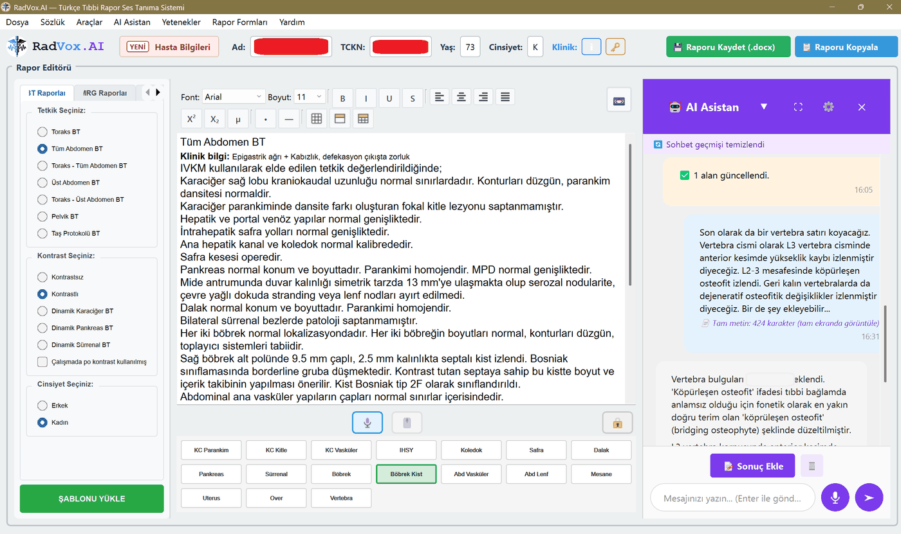
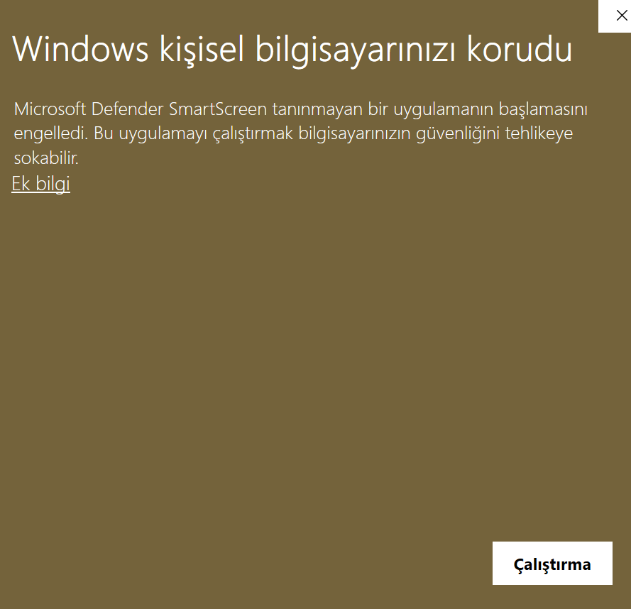

# RadVox Uygunluk Aracı

<p align="center">
  
  <br>
  <sub><b>Uygunluğunu ölçtüğünüz program:</b> RadVox.AI — solda hızlı rapor
  giriş formları, ortada rapor editörü ve dikte, sağda AI asistan.
  <i>Bu depodaki araç RadVox'un kendisi değil, bilgisayarınızın onu
  çalıştırıp çalıştıramayacağını ölçen küçük yardımcıdır.</i></sub>
</p>


Bu bilgisayar Türkçe radyoloji diktesini kaldırır mı? Araç donanımı okur,
RadVox'un isterleriyle karşılaştırır ve ekrana bir **uygunluk belgesi** verir:
hangi Whisper modeli çalışır, 15 saniyelik bir dikte kaç saniyede yazıya
döner, Türkçe tıbbi metinde beklenen kelime hatası nedir.

NVIDIA kartı olmayan bilgisayarı elemez. Dikte işlemcide de çalışır, ve
RadVox'un gövdesi — hızlı rapor giriş formları, akıllı tamamlama, kişisel
sözlük, karşılaştırma, RIS'e biçimli yapıştırma — donanımdan bağımsızdır.
Belge her kademede hangi özelliklerin çalıştığını tek tek yazar.

---

## ⚠️ İndireceğiniz dosya bu değil

Bu depo aracın **kaynak kodudur**. Kullanmak için Python bilmenize gerek yok
— aslında hiçbir şey indirmenize de gerek yok:

> ### [→ uygunluk.mutlugulbay.com](https://uygunluk.mutlugulbay.com)
> Sayfayı açın, birkaç saniyede sonucunuzu görün. Kurulum yok, indirme yok.

Tarayıcı ekran kartı belleğini ve sürücü sürümünü göremez; bunlar hangi
modelin çalışacağını doğrudan belirleyen iki bilgidir. **Kesin sonuç
istiyorsanız** masaüstü aracını çalıştırın — donanımı doğrudan okur ve
yazdırılabilir bir uygunluk belgesi üretir:

> **[→ Çalıştırılabilir dosyayı indirin (Releases)](../../releases/latest)**

İndirin, çift tıklayın. Kurulum yok, bir şey yüklemez, birkaç saniyede
raporunuzu tarayıcıda açar.

Kaynak kod burada **okunabilsin diye** duruyor — aşağıdaki "Ne yapar, ne
yapmaz" bölümünü doğrulamak isteyen olursa diye.

---

## Ne yapar, ne yapmaz

**Okur:** işletim sistemi ve yapı numarası, işlemci modeli ve çekirdek
sayısı, bellek, boş disk alanı ve disk türü, ekran çözünürlüğü, ses giriş
aygıtları, ekran kartları — ve NVIDIA kartı varsa `nvidia-smi` üzerinden
VRAM, sürücü sürümü ve compute capability.

**Yazar:** kendi yanına tek bir `.html` dosyası. Başka hiçbir yere
dokunmaz; kayıt defterine yazmaz, hiçbir şey kurmaz.

**Göndermez:** hiçbir şey. Araç ağ bağlantısı açmaz. Kodda tek bir
`socket` kullanımı vardır (`socket.gethostname()`) ve o da yalnızca
bilgisayar adını okuyan yerel bir çağrıdır — `urllib`, `requests`, `http`
ya da soket bağlantısı geçmez. Doğrulamak için aramanız yeterli.

**Kaldırmak için:** dosyayı silin. Arkasında bir şey bırakmaz.

---

## Hastane BT birimi için

Araç **yalnızca Python standart kütüphanesini** kullanır. Sanal ortam,
`pip install`, harici bağımlılık yoktur. Python 3.8+ kurulu bir makinede
kaynağı doğrudan koşabilirsiniz:

```
python radvox_uygunluk.py --konsol
```

| Bayrak | Ne yapar |
|---|---|
| *(bayraksız)* | HTML belgeyi üretir ve tarayıcıda açar |
| `--konsol` | Yalnız metin özet yazar, dosya üretmez |
| `--json` | Tespit edilen ham veriyi JSON olarak basar |
| `--cikti DOSYA` | HTML'in yazılacağı yolu belirler |
| `--acma` | Belgeyi üretir ama tarayıcıda açmaz |

Ayrıntılı donanım sorgusu PowerShell/CIM üzerinden yapılır. Kurum politikası
bunu engelliyorsa araç durmaz: `ctypes` ve kayıt defteri üzerinden temel
ölçüme düşer ve raporda hangi bilginin eksik kaldığını açıkça yazar.

Çalıştırılabilir dosya PyInstaller ile paketlenmiştir ve **kod imzası
yoktur**; Windows SmartScreen "bilinmeyen yayımcı" uyarısı verebilir.
Her sürümün SHA-256 özeti ilgili Release notunda yayımlanır.

---

## Hız ve doğruluk sayıları hakkında

Belgedeki süreler ve kelime hatası oranları **öngörüdür** — model
büyüklüğü, donanım sınıfı ve saha gözlemine dayanan tahmindir, o
bilgisayarda çalıştırılmış bir ölçüm değildir. Belge bunu kendi içinde de
açıkça belirtir. Gerçek sonuç en çok mikrofon kalitesine, ortam
gürültüsüne ve konuşma hızına bağlıdır.

---

## Windows uyarısı — göreceğiniz ekran



Dosyayı ilk çalıştırdığınızda Windows bu ekranı gösterir. **Beklenen bir
durumdur** ve dosyada bir sorun olduğu anlamına gelmez: araç kod imzası
taşımıyor, Windows da tanımadığı her programa aynı uyarıyı verir.

Dikkat edin — görünen düğme **"Çalıştırma"**, yani *çalıştırma*. Devam
etmek için:

1. Metnin altındaki **Ek bilgi** bağlantısına tıklayın
2. Beliren **Yine de çalıştır** düğmesine basın

**Neden imzasız:** kod imzalama sertifikası tüzel kişilik ve yıllık ücret
gerektiriyor, süreç devam ediyor. İmza gelene kadar yapabileceğimiz şey
şeffaflık: kaynak kod bu depoda okunabilir durumda ve her sürümün SHA-256
özeti Release notunda yayımlanıyor. İndirdiğiniz dosyanın yayımladığımız
dosya olduğunu şununla doğrulayabilirsiniz:

```powershell
Get-FileHash .\RadVox-Uygunluk.exe -Algorithm SHA256
```

---

## Telif

© 2026 RadVox.AI — Tüm hakları saklıdır.

Kaynak kod incelenebilmesi için yayımlanmıştır. Kopyalama, değiştirme,
dağıtma ve türev çalışma üretme hakları saklıdır; bu depoda açık bir
lisans verilmemiştir.
